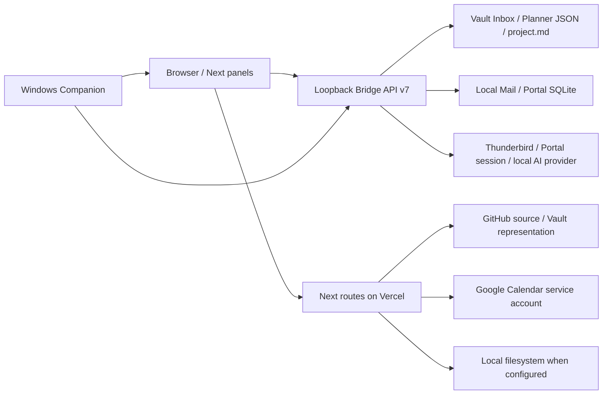

# Master Thesis OS / Chocomint Lab — Architecture Assessment

작성일: 2026-09-30 (Asia/Seoul). 상태: **Proposed / 읽기 전용 assessment**. 실행·승인된 target architecture가 아니다.

## Evidence baseline and scope

- Repository: `D:/Users/yeonj/Documents/Obsidian Vault/master-thesis-os`.
- Branch: `main`. HEAD 및 로컬 `origin/main`: `8706d9e3a14aaa367bee7c7d4c4a871d65904909` — `Sync app worktree and current GitHub changes`, 2026-09-29 19:04:04 +09:00.
- `git ls-remote origin refs/heads/main`도 같은 SHA를 반환했다. fetch/checkout 없이 원격 최신 tip과 보유 object의 일치를 확인했다. production 배포 SHA나 설치본 SHA가 이 SHA라는 뜻은 아니다.
- 시작 시 local-only 변경: `exporter/export_results.py:20`, `schemas/decomposition.schema.json:27`, `schemas/necessary_labour.schema.json:27`의 method version을 `2026-09-03`에서 `2026-09-29-D011`로 바꾼 각 1줄. committed architecture와 구분하며 수정·stash·복원하지 않는다.
- tracked file 252개. 현재 파일 기준 `bridge.py` 1,816줄, `mail_db.py` 991줄, `portal_db.py` 1,788줄, `calendar.ts` 616줄, `page.tsx` 738줄. 크기는 탐색 단서이며 그 자체가 분리 근거는 아니다.
- 실제 source, import/call, route, packaging, tests를 읽었다. build/unit/E2E/Playwright, application import, live Bridge 호출, DB open, sync, AI, Calendar write, Companion 설치/재시작, Vercel 설정/배포는 실행하지 않았다. 테스트를 읽은 것은 테스트 통과나 production 재검증이 아니다.
- 이 작업은 application architecture 준비로, 필요노동 연구 방법·결과를 변경하지 않는다. 볼트 연구 Wiki 갱신은 불필요하다.

### Skills and routing

기존 설치를 재사용했다. 설치·업데이트·restart·dependency 추가 없음.

| Skill | 설치 근거 / 사용 범위 |
| --- | --- |
| `task-routing` | `C:/Users/yeonj/.codex/skills/task-routing/SKILL.md`; 판단·통합은 root, 범위가 정해진 사실 추출만 worker |
| `skill-installer` | preinstalled system skill; 기존 destination이 있으므로 중복 설치하지 않음 |
| Ponytail full | `C:/Users/yeonj/.codex/plugins/cache/ponytail/ponytail/4.10.0/skills/ponytail/SKILL.md`; `config.toml`에 official Git marketplace 및 `ponytail@ponytail enabled=true` 확인 |
| `architecture-audit` | `C:/Users/yeonj/.codex/skills/architecture-audit/SKILL.md` 및 deep-modules reference; 지정 [upstream](https://github.com/helderberto/agent-skills/tree/main/skills/architecture-audit) 확인 |
| `codebase-design` | `C:/Users/yeonj/.codex/skills/codebase-design/SKILL.md`, `DEEPENING.md`; 지정 [upstream](https://github.com/mattpocock/skills/tree/main/skills/engineering/codebase-design)와 같은 vocabulary/workflow 계열 |
| `architectural-refactor` | `C:/Users/yeonj/.codex/skills/architectural-refactor/SKILL.md`; 지정 [upstream](https://github.com/petekp/agent-skills/tree/main/skills/architectural-refactor) 확인. chunk 원칙만 참고, execution workflow 비활성 |

[Ponytail 공식 repo](https://github.com/DietrichGebert/ponytail)와 로컬 hook JSON 및 activation/subagent/mode-tracker/runtime/config JS를 읽었다. Codex 경로는 plugin data에 mode flag를 쓰고 instruction context를 출력한다. 명시적 default 명령은 user config를 쓸 수 있다. 이 작업에서 hook 설치/재실행/default 변경은 하지 않았다. 검토한 hook에 application source 수정·sync·deploy 동작은 없다.

사용자 지정 두 문서·무질문 초안·source 불변 계약이 skill의 별도 PRD 경로, design 선택 질문, manifest/full verification 실행보다 우선한다. 현재 architecture 판단은 root에 남겼으며, architecture-audit의 exploration 및 task-routing이 허용한 독립 read-only 사실 추출 3개만 위임했다. 현재 tool schema는 model/effort override와 `fork_turns=none`을 지원하지만 spawn 반환에는 effective identity가 없다. root의 effective model/effort 역시 독립 metadata로 확인하지 못했다. 요청값을 실제 identity로 간주하지 않는다. routing records는 아래 Evidence appendix에 보존한다.

# Current Architecture

## Tree, entry points and dependency direction

| Module / entry | 현재 책임과 실제 dependency |
| --- | --- |
| `app/layout.tsx:1` | global CSS 순서, 한국어 document, `ResolutionSync`; wallpaper CSS도 global import |
| `app/page.tsx:155` | navigation/home/settings composition + 초기 dashboard load + Inbox cache/Vault write serialization + AI preview/apply + Planner/Calendar routing + project association |
| `app/mail-panel.tsx`, `school-mail-panel.tsx` | SQLite analyzed folders와 Thunderbird live Inbox 표시, filters/read/priority/detail/polling. `mail-analysis-client`, `thunderbird-mail`, `mail-list`, `mail-priority`, `mail-action` 사용 |
| `app/portal-notices-panel.tsx` | semester/archive/filter/compact list/detail/read state 및 AI queue polling; `portal-notices-client`, `portal-notice-ai`, Calendar candidate UI |
| `app/inbox-panel.tsx` | page가 전달한 state/action의 presentation + QuickCapture. 파일을 작게 나눈다고 persistence orchestration이 없어지지는 않음 |
| `app/planner-panel.tsx:25` | Calendar month/week, Vault Planner tasks/cache reconciliation, 별도 Mail planning candidate/task 조회 |
| `app/research-panel.tsx:24` | manifests, local workspace, metadata/favorites, project-linked Planner task projection, results 선택. `project-workspace-client`, `planner-tasks-client`, results views |
| `app/library-panel.tsx`, `shortcuts-panel.tsx` | curated paper index와 shortcut UI; 각각 library/shortcuts domain 및 existing data access 사용 |
| `lib/client-api.ts` | same-origin Next API envelope와 dashboard operations. Calendar read retry/range/month 포함 |
| `lib/*-client.ts`, `lib/thunderbird-mail.ts` | browser → loopback Bridge transport 또는 same-origin Calendar transport. domain별 validation/errors가 다름 |
| `app/api/**/route.ts` | Next request parsing/envelope; Calendar, GitHub/Vault, research/projects, results, library, shortcuts endpoints |
| `lib/calendar.ts:88–616` | config, JWT/token cache, Google HTTP/error normalization, events/ranges, multi-calendar read/cache, idempotent creation |
| `lib/repository.ts` | pure path safety/classification/types. transport module이 아님 |
| `lib/vault-repository.ts:42` | GitHub 우선 또는 local filesystem의 실제 두 adapter; read text/bytes/tree/manifests, SHA conflict, atomic local write |
| `lib/github.ts` | GitHub HTTP/cache/content/SHA write; browser Bridge SQLite 접근과 별개 |
| `lib/projects.ts`, `research-status.ts`, `inbox.ts`, `planner-tasks.ts` | manifest/status parsing 및 browser-side normalization/cache/pure projections |
| `app/results-panel.tsx:21` | standard inventory 선택 + legacy fallback. `standard-results-view` → `/api/project-results` → `project-results-loader` → Vault → CSV/XLSX `results-data` |
| `app/results-panel-legacy.tsx`, `result-view-components.tsx`, `lib/results.ts` | 기존 necessary-labour/decomposition dashboard compatibility, generic standard view와 병존 |
| `local-bridge/bridge.py` | top-level config/env/bootstrap, HTTP/security/envelopes, JSON Vault stores/metadata/workspace, Mail/Portal thread lifecycle, Portal batch loop, OS launch |
| `bridge_config.py`, `bridge_security.py` | config precedence/token/origins/path constraints/constant-time token checking. 이미 의미 있는 module |
| `mail_cli.py`, `mail_db.py`, `thunderbird_mail.py` | collection/provider normalization/batch analysis, SQLite persistence/claim/tasks, Thunderbird discovery/read/launch |
| `portal_cli.py`, `portal_client.py`, `portal_db.py`, `portal_ai.py` | Playwright Portal session/collection, SQLite notices/terms/archive/queue, provider batch/translation/candidates. `portal_ai`는 Inbox organizing도 포함 |
| `experiments/wallpaper-host-poc` | 독립 C# Windows Companion release·tray·WebView·Bridge process manager·installer. 명칭과 달리 shipping deliverable |
| `experiments/android-home-poc`, `windows-widget-poc` | standalone Android/Windows widget entry/build/package 경로; Next main import 경로 없음 |
| `exporter/`, `schemas/`, `scripts/` | offline research result export/data contracts, release version checks, 명시적 live smoke tools. application boot에서 exporter나 smoke script를 자동 실행하지 않음 |



Vercel 서버가 사용자의 loopback Bridge에 접속하는 구조가 아니다. 브라우저가 Bridge에 직접 접속한다. Vercel server의 GitHub representation과 Bridge의 local Vault가 자동으로 한 transaction에 묶이지 않는다. Calendar credential은 server env, Bridge token은 browser localStorage 및 local config, Portal session/Thunderbird/SQLite는 local runtime 책임이다.

## Actual flows and state owners

**Mail:** `bridge._run_sync_job:836` → `mail_cli.sync_mail(..., analyze=False):903` → `TARGET_FOLDERS = school-work, international-office` → DB mail/queued records. 성공 후 `_ensure_mail_ai_worker:866` → `_run_mail_ai_job:852` → `analyze_new:953` → `_analyze_queued` → DB conditional per-item claim → provider batch(현재 3) → per-item completed/failed/task/candidate writes → queued count가 0까지 반복. live `inbox`는 Thunderbird 경로이며 analyzed target folders와 다르다.

**Portal:** `_run_portal_sync_job:917` → `portal_cli.sync_portal` → summary/detail upsert 및 term/archive metadata → 성공 후 `queue_portal_ai_backfill:1053`. `notices_needing_analysis:779`는 body/content hash, prompt/model freshness 및 retry policy로 후보를 고른다. `claim_notice_analysis_batch:872`는 `BEGIN IMMEDIATE`로 queued를 processing으로 claim. `_run_portal_ai_worker:949` → `portal_ai.analyze_notices` (현재 3) → 개별 transaction으로 결과/candidates 저장. collection/login thread와 AI thread는 분리되어 있다.

**Inbox → Planner → Research:** page cache capture → `/inbox` merge → `shared/inbox/inbox.json`. AI preview는 저장 전 presentation state. apply는 raw fields를 보존하고 explicit full-year date만 사용한다. todo는 `inbox:<entryId>` Planner task; schedule은 same-origin Calendar create. `_sync_inbox_planner_tasks:440`는 canonical ID 및 기존 status/project association을 보존한다. project association은 `/planner/tasks/update`의 task.projectId다. Research의 다음 작업은 이 Planner store를 projectId로 filtering한 projection (`research-panel:89,231`); linked task를 manifest에 복제하지 않는다. `project.md`의 nextTasks는 별도 수동 markdown 목록이고 Home/slot/wallpaper fallback에도 사용된다.

**Calendar:** `/api/calendar/events` GET validates range → `getCalendarEvents:567` → cached service account token → calendar IDs 순회 → normalized items/dedup/sort/cache. POST → `createCalendarEvent:507` → deterministic ID → configured 첫 calendar → insert; 409는 existing event GET 후 created=false. `calendar-client`는 HTTP와 response checking을 제공하며 단순 pass-through가 아니다.

**Runtime:** `Publish-Release.ps1:13` explicit Python file allowlist를 `app/bridge-runtime`으로 copy. `BridgeProcessManager.cs:285` packaged runtime을 우선하고 dev/local fallback을 검색한다. `Install-WallpaperHost.ps1:153` config는 shared data directory에 없을 때만 migrate하고 release contents만 copy. `bridge_config.resolve_config_path:19`는 explicit override → shared AppData config → source config. `bridge._resolve_bridge_db_path:69`, `_resolve_portal_db_path:773`는 env override와 Vault/source discovery를 사용한다. DB가 언제나 AppData 아래 있다는 추정은 금지한다.

# Stable Invariants

아래는 코드로 확인한 preservation baseline이다. **현재 통과를 실행 검증했다는 뜻은 아니다.** 불완전한 보장은 따로 표시한다.

| 영역 | 유지해야 하는 behavior / 근거 |
| --- | --- |
| Bridge compatibility | `bridge.py:36,1356` v7 health envelope; `bridge-status.ts:3,26`는 version >=7을 compatible로 취급. exact v7 only 또는 capability handshake로 임의 변경 금지 |
| Config/security | `bridge_config.py:19,50`, `bridge_security.py`, `Handler.do_GET/do_POST`: override/shared/source precedence, token 원문 보존, exact allowed origins, body size/path limits, POST body token / protected GET header token, loopback binding. config error exit 78 및 supervisor non-retry 유지 |
| Runtime/data | Companion/web는 독립 버전 (`VERSIONING.md` web 1.3.0 / Companion 0.6.1). runtime copy 교체는 config/Vault/DB reset을 의미하지 않아야 함. DB 실제 path resolution 불변 |
| Portal persistence | SQLite notices/attachments/state/academic terms/archive/sync runs/AI/candidates 유지; upsert는 기존 local state를 보존. prompt/model/content_hash freshness 유지 (`portal_db:779,1029`), completed result와 candidate 상태의 reanalysis 보존 |
| Portal recovery | inactive sync recovery; inactive AI의 queued/processing → failed/ai_interrupted → backfill requeue (`portal_db:1007`, `bridge:1209`). 일반 failed는 explicit include_failed 또는 notice force retry. Mail 방식으로 바꾸지 않음 |
| Mail persistence | Thunderbird source IDs/message ID/fallback dedup, target folders, SQLite mail/analysis/tasks/candidates, collection/analysis 분리. processing → queued recovery (`mail_db:833`), conditional claim (`:623`), queue drain (`bridge:852`) |
| Batch result isolation | 정상 result 저장은 item별 transaction/try-catch (`mail_cli:844`, `bridge:1006`, `mail_db.save_completed`, `portal_db.save_notice_analysis`). 기존 성공 결과는 한 item failure로 rollback되지 않음. **모든 실패 기록 branch가 다음 item 처리를 보장하지는 않음**: Findings F3 |
| Mail semantics | Thunderbird isRead와 priority normal/important/critical 독립; unread typography, filtering/sorting/tie order 유지 (`mail-list.ts`, `mail-priority.ts`, panel tests). UI에서 read 상태를 priority와 동치로 만들지 않음 |
| Calendar config/auth | Google service account RS256/JWT/read-write scope; comma-separated `GOOGLE_CALENDAR_IDS` trim/dedup 및 legacy single ID fallback (`calendar:88,310`). configured list 순서 보존 |
| Calendar read | 한 read failure는 나머지 read를 막지 않음; 모든 calendar 실패할 때 throw. 성공 calendar가 empty여도 전체가 전부 실패하지 않았다면 empty 반환 가능. dedup key = calendarId + id + start, global start sorting, Seoul all-day/range, TTL 5분/token skew 1분 유지 (`calendar:440,567`) |
| Calendar create | SHA256(mailId + NUL + candidateId), first configured calendar, all-day exclusive end/default next day, timed defaults/validation, sendUpdates=none, 409 existing GET, successful write/409 cache clear (`calendar:201,507`). ID에서 source를 추가해 기존 event identity를 바꾸지 않음 |
| Inbox raw/merge | Vault의 기존 id/rawText/createdAt 불변; newer AI processedAt merge, related IDs 정리; atomic temp/fsync/replace; deletedEntryIds tombstone로 stale writes resurrection 방지 (`bridge:193–315`) |
| Planner/link | stable inbox:<id>, existing completion/project association 보존, old linked ID canonicalization, tombstone respect, cache latest updatedAt merge. bulk update는 기존 task status/updatedAt/completedAt만 반영; single existing task 재추가는 completion/project를 reset하지 않음 (`bridge:410–519`) |
| Completion/projection | Planner pending↔done 및 completedAt set/clear (`planner-panel:135`), Research 같은 linked tasks와 done 스타일 표시 (`research-panel:231`). Inbox processed는 task done과 동치가 아님 |
| UI | School Notice compact flat hierarchy와 Mail 동계열 hierarchy, unread typography, 세 priority, chocolate sidebar/warm off-white/mint accent. `layout.tsx` stylesheet 순서 및 `chocomint-theme.css:1,44,2571` 유지; redesign 없음 |
| Results/other integrations | standard loader source consistency/path checks, legacy fallback, Microsoft Settings 및 `/wallpaper` route 유지. 이름이 legacy/poc라는 이유로 삭제 금지 |

Status GET는 read-only가 아니다. `_mail_status:1183`는 recovery/worker start, `_portal_status:1209`는 recovery/backfill/worker start를 한다. DB `_connect`도 initialize/ALTER/backfill 작업을 포함할 수 있다. 실행 시점 이동 역시 observable behavior 변경이므로 이번 preservation refactor에 포함하지 않는다.

`/mail/analysis`, `/mail/planning`, `/portal/notices` 응답도 각각 status helper를 포함한다 (`bridge.py:1286–1346`). 명칭이 list/read여도 이 audit에서는 live 호출하지 않았다. Mail ordinary resync는 기존 completed analysis를 content/prompt/model 변경으로 자동 invalidate하지 않는다 (`mail_db.upsert_mail:472–548`); Portal freshness 정책을 Mail에 소급 적용하지 않는다.

# Findings

## F1 — Bridge가 HTTP, 지속 state, worker lifetime을 함께 소유

- **Severity high / confidence high.** 현재 responsibility: `bridge.py:69–798` data path, Inbox/Planner merge/atomic writes/project metadata; `:813–1102` worker state 및 scheduling; `Handler:1112–1810` HTTP; 마지막 줄에서 즉시 server start.
- **문제:** 새로운 domain operation은 router, locks/global thread, response status, DB policy를 동시에 이해해야 한다. Portal batch processing까지 transport 파일에 있다. source import도 config load/server start를 일으켜 worker seam 테스트가 어렵다.
- **다음 기능 friction:** cancel/retry/progress policy 추가 시 HTTP tests와 domain tests 사이를 왕복하고 installed file allowlist까지 수정한다.
- **Evidence:** `_run_mail_ai_job`, `_run_portal_ai_worker`, `_ensure_*`, `_sync_inbox_planner_tasks`, `_update_project_metadata`, Handler status/post. 한 책임 분리당 domain-owned concrete module 1개를 목표로 한다. router registry/framework를 만들 필요는 없다.

## F2 — 관측, recovery, work scheduling이 status assembly에 결합

- **Severity high / confidence high.** `Handler._mail_status:1183`, `_portal_status:1209`, `MAIL_*`/`PORTAL_*` globals와 DB progress가 결합되어 있다.
- **문제:** DB queue 상태는 durable business state이고 thread.is_alive는 process liveness인데 응답을 만드는 곳이 둘의 재조정까지 한다. 관측 polling이 실제 일을 시작한다. 별도 CLI와 Bridge의 recovery ownership도 주의해야 한다.
- **다음 기능 friction:** unattended processing 또는 다중 process 지원 시 inactive thread 관측만으로 DB processing을 interrupted라고 판단할 위험. 현재 single-runtime 운영 조건을 보존해야 한다.
- **Evidence:** Mail recovery processing→queued와 Portal queued/processing→failed가 다름. HTTP status contract 유지하면서 policy를 worker owner로 옮기되 호출 순서는 그대로 유지. status pure-read 변경은 별도 behavior proposal이다.

## F3 — batch isolation은 정상 결과 save 경로에 강하지만 모든 오류 경로에 완전하지 않음

- **Severity medium / confidence high.** `mail_cli._analyze_queued:781–900`: preparation error 및 provider failure loop의 save_failed는 별도 catch 없이 호출. Portal worker `bridge:949–1031`: missing notice/result의 save_notice_analysis_failed도 일부는 outer try까지 전파된다.
- **문제:** 성공 결과는 per-item transaction이어서 보존되지만 failed marker write까지 실패하면 나머지 batch가 멈출 수 있다. 사용자 invariant를 완전한 현재 보장으로 쓰면 부정확하다.
- **다음 기능 friction:** retry/backfill 규모 증가 시 처리량·progress와 DB processing 잔존이 엇갈릴 수 있다.
- **Evidence:** Mail completed save exception branch는 nested catch, Portal save exception branch도 nested catch; 다른 branch와 대비된다. 실제 fault injection은 실행하지 않았으므로 runtime 빈도는 미확인.
- **제안:** worker extraction은 이 behavior까지 보존한다. 모든 marker failure isolation을 강화하는 것은 별도 correctness change로 승인·실패 주입 후 처리하며 구조 변경 commit에 숨기지 않는다.

## F4 — Inbox/Planner canonical data는 명확하지만 ownership이 shell과 여러 panel에 흩어짐

- **Severity high / confidence high.** `page.tsx:214,314,433,482,521`; `planner-panel:58,135`; `research-panel:89`; `bridge:239,285,410,440`.
- **문제:** cache→Vault merge, write serialization/revision, AI apply, task/schedule dispatch가 composition에 있다. Planner/Research가 같은 durable task를 각자 reload/cache한다. raw Inbox와 task 상태의 관계를 UI action마다 이해해야 한다.
- **다음 기능 friction:** Home에서 linked task 완료나 다른 feature에서 todo 생성 시 reconciliation/association/deletion 규칙을 또 구현할 가능성이 가장 크다.
- **Evidence:** Research는 store를 받아 tombstone filter 후 cache 갱신, Planner는 cache 최신 completion을 merge한 뒤 저장. 이는 완전히 같은 load policy가 아니므로 하나의 generic state hook으로 즉시 합치지 않는다.
- **보장 한계:** `_delete_inbox_entry`는 Planner write 후 Inbox write. 개별 atomic file replace이나 두 파일 전체 transaction은 아니다. extraction으로 crash consistency가 개선됐다고 주장하지 않는다.

## F5 — Calendar는 deep 외부 interface를 갖지만 provider 구현이 같은 파일에 집중

- **Severity medium / confidence high.** `calendar.ts:93,310,342,402,450,489,507,567`. env/auth/token/error/HTTP/normalization/read aggregation/write/cache가 함께 있다.
- **문제:** provider 오류/auth 변경과 domain read/write policy의 verification 범위를 분리하기 어렵다. 그러나 `getCalendarEvents/createCalendarEvent`는 이미 유용한 small interface이고 route는 충분히 thin하다.
- **다음 기능 friction:** provider pagination/auth retry 변경 시 aggregation 및 deterministic write regression 위험.
- **최소 seam:** Google auth+HTTP+error implementation 하나를 내부 module로 추출; 기존 calendar.ts가 config policy·normalization·aggregation/event cache/write ID를 계속 소유. Error class identity를 유지하고 circular import를 만들지 않는다. token cache는 provider, event cache/invalidation은 calendar owner.
- **Evidence:** fetchImpl/now 및 clearCalendarCacheForTests seam이 이미 있음. 다수 provider interface/strategy/DI container는 불필요하다. pagination 등 기능 변경을 이 chunk에 포함하지 않는다.

## F6 — runtime source drift 자체보다 provenance/packaging 중복이 문제

- **Severity high / confidence high.** `Publish-Release.ps1:13`, `BridgeProcessManager.cs:13,285`, installer, `bridge_config:19`, `bridge-status.ts:3`.
- **문제:** publish allowlist와 C# required file list가 별개이며 source 추가 시 release에서 누락될 수 있다. packaged runtime 우선/현재 실행 process 재사용은 repository edit만으로 설치본이 갱신되지 않음을 의미한다. Companion health는 HTTP success만 보고 web는 numeric version threshold를 본다.
- **다음 기능 friction:** 새 worker module이 repo에서 정상이어도 기존 installer artifact에 없으면 설치 runtime 실패. API v7이라는 정보만으로 source revision drift는 식별할 수 없다.
- **제안:** 기존 release process의 artifact에 source commit/API version/file hashes를 남기고 package completeness를 offline verification; 수동 install은 별도 release 단계. public health JSON 변경, runtime autodownload/updater, startup migration은 필요 없다.
- **한계:** 설치본·Vercel metadata를 실제 조회하지 않았으므로 실제 drift를 확정하지 않는다. source/config/data lifecycle 분리는 장점이며 합쳐서는 안 된다.

## F7 — client transport 반복은 있지만 generic consolidation의 비용이 큼

- **Severity low / confidence high.** `mail-analysis-client:36–88`, `portal-notices-client:244–305`, `inbox-persistence-client:25–99`, `planner-tasks-client:9–43`, `project-workspace-client:43–74`.
- **문제:** base URL/token/abort/Sucrose loopback option/JSON reading이 반복. 한 browser networking 변경이 여러 곳에 전파된다.
- **다음 기능 friction:** token/address-space 정책 변경의 반복 수정. 반면 timeout, envelope, error taxonomy/version behavior는 다르다.
- **결론:** 현재 7 chunk에는 공통 fetch framework를 넣지 않는다. 동일한 request-init 몇 줄이 실제로 동일함을 fixture로 증명한 뒤 기존 `bridge-status` 근처에 작은 utility를 둘 수 있다. caller-specific validation/error/polling 유지. normal/important/critical 문자열 또는 queued 이름만으로 shared domain type을 만들지 않는다.

## Additional verification and orchestration findings

**F8 — 검증 기준선의 오래된 API assertion. Severity medium / confidence high.** `local-bridge/test_bridge.py:412`는 health apiVersion을 5로 기대하지만 `bridge.py:36`과 `lib/bridge-status.ts:3`은 7이다. 이는 실행 없이 확인한 source-level 모순이며, test suite 통과를 주장할 수 없다. 향후 chunk entry 전에 baseline을 분리 기록하고 이 기대값의 정정 승인을 확인한다. tests는 읽기만 했고 수정하지 않았다. Planner endpoint·Inbox deletion task cascade·worker batch fault/recovery integration의 직접 검증도 부족하다. `planner-tasks.test.ts`의 pure helper 보장을 backend linkage 전체 보장으로 확대하지 않는다.

**F9 — Inbox apply의 persistence failure와 downstream routing이 분리되지 않음. Severity high / confidence high.** `page.tsx:320–346`의 persistInboxToVault는 저장 실패를 catch하고 정상 resolve한다. `applyInboxPreview:433–475`는 결과 성공 여부를 검사하지 않고 Planner/Calendar 전달을 이어간다. 따라서 Inbox durable save 실패 뒤 task 생성이 가능하다. schedule은 processed 상태가 된 후 Calendar write를 시도하며 organize는 unprocessed만 고르므로 UI 자체가 실패 schedule을 자동 재시도하지 않는다. deterministic Calendar ID는 재호출 중복 방지이지 UI retry 보장이 아니다. 새 todo/schedule 진입점을 추가하면 이 orchestration policy를 복제할 위험이 있다. C4는 현재 순서/에러를 characterization한 뒤 구조만 분리하고, success-gated dispatch/retry 변경은 별도 correctness scope로 둔다.

**F10 — Results schema와 runtime validation이 별개. Severity low / confidence high.** `schemas/results-view.schema.json`은 runtime/exporter import가 없고 `project-results-loader.ts:129–199`가 수동 validators를 소유한다. exporter의 legacy JSON schema와 standard result/view/data 계약을 혼동하지 않는다. 새 view type 추가 시 두 정의가 drift할 가능성은 있으나 schema engine/dependency 도입은 현재 근거가 부족하다. standard schema를 dead file로 삭제하지 않고 contract/reference로 유지한다.

# Keep As-Is

- **Flat feature names:** panels와 `lib/*-client`는 prefix 검색이 쉬우며 import direction을 이미 드러낸다. 모든 feature folder 이동은 locality 증가 증거 없이 import churn만 만든다. 전체 재배치 없음.
- **Concrete DB modules:** `mail_db`/`portal_db`가 SQL/transactions/state normalization을 소유하고 서로 다른 schema·recovery·freshness를 숨긴다. generic repository/queue table/ORM 추가 없음. DB 크기는 schema 변경 이유가 아니다.
- **Config/security/launch seam:** `bridge_config`, `bridge_security`, `shortcut_launcher`, `thunderbird_mail`의 구체적 책임 유지. Windows process lifecycle도 web UI로 끌어오지 않음.
- **Vault repository:** 실제 GitHub/local 두 adapter와 SHA conflict/path/atomic write complexity를 숨긴다. 삭제하면 여러 routes/loaders에 복잡성이 재발하므로 deletion test를 통과한다. provider factory나 interface layer 추가 불필요.
- **Calendar date/view helpers:** browser-safe pure date/view locality와 테스트 유지. 전체 provider별 folder/library 분할 없음.
- **Results loader/view separation:** inventory, standard manifest/data validation, CSV/XLSX normalization, rendering이 실제로 다른 책임이다. offline exporter 실행을 UI runtime에 연결하지 않음.
- **Mail list/priority/action helpers:** 현재 실제 filter/normalization/order/date-action 의미를 제공하므로 pass-through가 아니다. 작은 private render helpers/Card는 별도 파일로 추출하지 않음.
- **Existing UI/CSS and user caches:** stylesheet 순서, compact rows, preferences/storage keys, offline cache, legacy normalization 유지. CSS 통합/디자인 시스템 도입은 제외.
- **Serial/calendar and item transactions:** 성능 자료 없이 concurrency/cache framework를 추가하지 않음. claim/individual commit의 integrity를 줄이지 않음.

# Proposed Target Architecture

현재 entry/API/file layout를 유지하고 실제 complexity의 owner만 바꾼다. Web composition은 navigation/layout/dashboard composition을 맡고 Inbox의 hydration/write queue/AI apply/link routing은 feature controller 하나에 둔다. 기존 panels와 domain clients는 유지한다. Bridge HTTP module은 config/bootstrap/auth/CORS/body validation/endpoint routing/status-code/envelope/OS dispatch를 맡고, Mail과 Portal의 각각 독립 실행 owner가 collection/AI lifecycle과 recovery orchestration을 맡는다. SQLite modules는 durable claim/completed/failed/progress/freshness를, thread state는 현재 process 실행 핸들·lock·last transient error만 소유한다. Vault workspace module은 Inbox/Planner JSON merge/tombstones/lock order/project metadata write를 함께 숨긴다. Calendar는 기존 public interface 뒤에 하나의 Google provider internal seam만 추가한다. Companion은 기존 packaging을 유지하며 artifact provenance/offline completeness만 보강한다.

제안 filename은 책임을 설명하기 위한 후보이지 승인된 move manifest가 아니다: `local-bridge/mail_jobs.py`, `portal_jobs.py`, `workspace_store.py`; `app/use-inbox-workflow.ts`; `lib/calendar-google.ts`. 실제 분할에서 public surface가 private helper 나열이 되면 module 수를 늘리지 말고 범위를 재설계한다. runtime code 추가 시 publish allowlist/C# required files/test expectations를 같은 commit에 포함하되 설치본은 변경하지 않는다.

## Ownership and dependency constraints

1. Browser feature → existing domain client → Bridge HTTP → domain execution/store. domain execution은 Handler를 import하지 않는다. config/paths는 bootstrap에서 전달하고 thread를 module import만으로 시작하지 않는다.
2. Domain worker → own DB + analyzer/collector. DB는 worker/router를 import하지 않는다. SQL state가 item status의 source of truth이고 thread liveness로 completed를 추정하지 않는다.
3. Workspace store는 ROOT/paths/locks와 related write ordering을 한 곳에서 설명한다. Inbox는 capture/raw/AI의 owner, Planner는 executable task status/project link의 owner, project.md는 metadata/manual nextTasks의 owner. cross-store atomicity 개선은 별도 scope.
4. React hook은 view state와 error/pending handling을 소유하지만 durable task authority는 local Vault다. localStorage는 offline working cache이며 newer completion reconciliation을 제거하지 않는다.
5. Calendar facade → internal Google provider. browser는 provider/auth를 runtime import하지 않는다. 지금의 type-only imports 유지. shared error/value definitions 필요 시 기존 calendar-dates 같은 browser-safe module을 활용할지 판단하되 tiny type-only file를 기계적으로 늘리지 않는다.
6. API v7 contract ownership은 Bridge endpoint/envelope와 existing web clients/tests에 있다. source SHA는 release provenance이지 API version이 아니다. config/DB migration은 existing local DB layer 책임; Vercel deploy와 함께 migration을 실행하지 않는다.

## Mail/Portal genuine overlap versus domain policy

| 행동 | 공통성 / 제안 |
| --- | --- |
| lock + thread start/finish + is_alive | 작은 shape는 동일. 두 concrete owner extraction 후 실제 LOC가 줄면 최소 helper만 고려; 지금은 framework 금지 |
| durable queued/processing/completed/failed | names만 같음. Mail per-ID conditional claim vs Portal transaction batch claim, recovery policy도 다름. DB 통합 금지 |
| batch size 3 / provider call / item save | orchestration shape 일부 공통이나 body fetching, outputs, counters, missing result/error handling 다름. analyzer/repository generic화 금지 |
| queue drain | Mail analyze_new 반복 + folder progress vs Portal claim-until-empty. callback이 API 표면을 키우면 shared utility도 하지 않음 |
| retry/freshness | Portal content/prompt/model freshness 및 interrupted policy가 명시적. Mail force/recovery policy와 다름. 동일 정책으로 바꾸지 않음 |
| polling/status | timeout/envelope/loading semantics 및 side effects 다름. UI 하나의 generic polling hook으로 합치지 않음 |

## Six seam tests

| Proposed seam | Deep module | Locality | Deletion | Change amplification | State ownership | Ponytail |
| --- | --- | --- | --- | --- | --- | --- |
| Mail execution owner | start/status/reanalyze가 thread/recovery/collector details 숨김 | lifecycle changes 한 module | mail runtime 삭제 범위 명확 | router가 thread globals 변경 불필요 | DB vs process 분리 | +1 module; wrapper만이면 거부 |
| Portal execution owner | batch orchestration·backfill·login/sync 숨김 | claim/provider/save loop 한 위치 | Portal jobs 제거 가능 | retry policy가 HTTP에 번지지 않음 | DB freshness와 thread 분리 | +1 module; generic JobRunner 없음 |
| Workspace store | merge/delete/link/metadata operations가 lock/atomic writes 숨김 | 연동 write invariant 한 곳 | Vault workflow 전체 삭제 범위 | helper choreography를 Handler에서 제거 | raw/task/manifest owner 명시 | +1 module; generic JSON repository 없음 |
| Inbox workflow hook | hydration/serialized persistence/preview/apply 묶음 | page가 workflow 알고리즘 제거 | feature controller+panel 삭제 | UI 진입점 추가 시 같은 workflow | preview/cache/durable distinction | +1 module; global state library 없음 |
| Planner reconciliation helper | 두 load policy 중 동일 normalization만 숨김 | existing planner-tasks 활용 | 삭제해도 caller duplication 생김 | tombstone/cache updates 감소 | completion authority 유지 | 기존 module 사용, net +0 |
| Calendar provider | token/Google errors/HTTP 숨김 | provider changes 한 곳 | facade callers 유지하며 제거 가능 | auth 변경이 UI/routes에 안 번짐 | token vs event cache 분리 | 최대 +1, auth/client/error 각각 파일 금지 |
| Package provenance | artifact mismatch를 offline에서 설명 | existing publish/check flow | updater dependency 없음 | list drift 확인 한 gate | source/install/data 분리 | runtime interface 추가 없음 |

## Legacy / experiments disposition

| 영역 | 분류 / 판단 / 근거 |
| --- | --- |
| `results-panel-legacy.tsx` | **유지 — active compatibility.** results-panel:4,76,85에서 import/fallback, Research도 results-panel 사용. dead candidate 아님 |
| standard results modules | **유지 — main path.** page/results 및 Research → standard view/loader, schemas/view format |
| legacy `GOOGLE_CALENDAR_ID` | **유지 — active configuration compatibility.** parseCalendarIds fallback/tests; 종료 시점 미확정 |
| `microsoft-mail-panel`, auth/outlook | **유지 — reachable Settings integration.** page import 및 settings render → MSAL/Graph. 주 analyzed Mail은 Thunderbird지만 Outlook가 dead라는 결론 불가 |
| `/wallpaper`, ResolutionSync/native shortcut | **유지 — Next route / Companion integration.** page route는 Next filesystem entry이므로 main import가 없어도 reachable; layout global sync/CSS |
| wallpaper-host-poc | **유지 — shipping runtime, 논리적으로 별도 deliverable.** VERSIONING, installer, publish, process manager. 폴더 rename하지 않음 |
| android-home-poc/windows-widget-poc | **현 위치 격리 유지 — standalone experiment.** 각각 entry/build/package가 있음; Next main path 밖이라는 사실만으로 사용자 사용 여부/dead 확정 불가 |
| history NativeImeFocusBridge `.txt/.md` | **보존 — historical evidence.** application compiled source와 구분. 삭제는 별도 사용자 결정 |
| scripts live smoke / calendar test | **유지 — explicit verification tools.** audit 실행 금지. runtime 자동 import와 구분 |
| exporter / research schemas | **유지 — offline producer + compatibility contracts.** local-only method change 제외. 데이터 consumer 사용을 끊지 않음 |

삭제를 제안할 수 있을 만큼 증명된 application dead module은 이번 조사에서 확정하지 않았다.

# Refactoring Candidates

우선순위는 routing/worker 책임 정리 → 관련 store/controller → provider → provenance. LOC 효과는 estimate이며 계측된 결과가 아니다.

| 순위 / candidate | Affected files | Benefit / 예상 LOC·module 효과 | Risk / preservation |
| --- | --- | --- | --- |
| 1 Mail execution extraction | bridge, new mail_jobs, mail_cli unchanged interface, test_bridge/mail analysis, publish/C# lists | HTTP에서 약 70–100 lifecycle 줄 이동; +1 module, total LOC 소폭 증가 가능 | medium; status recovery/start ordering, collector gate, queue drain 그대로 |
| 2 Portal execution extraction | bridge, new portal_jobs, portal DB/AI callers, tests, packaging lists | 약 200줄 lifecycle/batch 이동; +1 module | high; queued recovery/backfill/partial save/error precedence 유지 |
| 3 Workspace store extraction | bridge:87–772, new workspace_store, security/config dependencies, endpoint tests, lists | 약 650줄 responsibility 이동; +1 module | **highest**; lock order, tombstones, raw immutability, dual-file write order, SHA conflict 보존 |
| 4 Inbox feature controller | page, new use-inbox-workflow, inbox panel/domain clients tests | page에서 수백줄 제거; +1 module, orchestration duplicate 안 남김 | high; serialized writes/revision/error handling/apply route order 유지 |
| 5 Planner reconciliation/projection clarity | existing planner-tasks + tests, planner/research panels | 기존 함수 재사용; module +0, net LOC 감소 목표 | medium; 서로 다른 panel load 정책·offline completion·projectId 보존 |
| 6 Calendar internal provider | calendar, new calendar-google, calendar tests, route import compatibility | auth/HTTP implementation 이동; 최대 +1 module | medium/high; cache singleton, error identity, ID/first write target/partial reads 유지 |
| 7 Offline release provenance/completeness | existing publish/version check/runtime list tests, VERSIONING | 작은 verification LOC 추가; runtime module +0 | low/medium; health contract/install/config/DB 변경 없음 |

net runtime module 증가 상한 목표 +5. module 증가 자체를 개선으로 보고하지 않는다. net LOC는 wrappers/adapter factories를 만들면 증가하므로 각 chunk에서 moved LOC와 added orchestration/test LOC를 구분한다. 감소량을 미리 보장하지 않는다.

# Non-Goals

현재 단계는 두 문서 외 변경 금지. 다음 execution 초안도 redesign, 전체 feature-folder 이동, dependency/ORM/state management framework, DB schema/table migration, endpoint/API-v7 contract 변경, config/token/origin 변경, retry/freshness 정책 통일, installed runtime 교체, Vercel env/deploy, live sync/backfill/analysis/Calendar write, research methods/results 수정, 기존 user changes 정리를 포함하지 않는다. 테스트 실패를 계기로 unrelated fix를 시작하지 않는다. source refactor 승인과 실제 deploy/install 권한은 별개다.

# Open Questions

1. 실제 Vercel deployment SHA 및 installed Companion/Bridge source provenance는 미조회. source tip과 production 동일성을 주장하지 않는다. execution/release 전에 read-only metadata 또는 artifact evidence로 확인할 항목.
2. single Bridge process + CLI recovery 동시 실행을 운영에서 허용하는가? 현재 thread-local ownership은 cross-process lease가 아니다. refactor는 현재 model 유지, 다중 process support는 별도 설계.
3. 완전한 marker-write failure isolation, Inbox/Planner crash consistency 개선은 behavior/correctness 작업으로 따로 승인할 것인가? current extraction의 exit criteria에 몰래 넣지 않는다.
4. Home/slot/wallpaper manifest nextTasks와 Research linked Planner projection을 향후 한 UX로 통일할 것인가? 현재 별개 behavior 유지. 이것은 refactor 필수 결정이 아니다.
5. standalone widget/Android의 실제 사용자 사용 현황 및 single Calendar env retirement 시점은 code만으로 확정할 수 없다. 현 상태 유지 가능하므로 assessment를 막지 않는다.

## Explicit answers to the 12 requested questions

1. **첫 분리 책임:** Bridge의 durable domain execution과 HTTP response/routing. Mail owner를 작게 검증한 뒤 Portal로 확장; workspace store는 별도 high-risk chunk.
2. **bridge.py 과책임:** 그렇다. thread lifecycle/Portal batch, Inbox·Planner·project persistence를 밖으로. bootstrap/security/body/envelope/dispatch/HTTP exception mapping은 남긴다. 모든 route별 파일 분할은 하지 않는다.
3. **queue status source of truth:** SQLite item rows. in-memory는 thread/lock/current process liveness/transient job error. durable counts를 별도 mutable thread counter로 복제하지 않는다.
4. **공통 worker 가치:** 현재 generic lifecycle 전체 통합 근거 부족. concrete extraction 후 lock/start/finish 최소 utility로 실제 삭제량이 증명되는 경우만. repository/analyzer/freshness/recovery는 domain별 유지.
5. **Calendar:** 책임이 집중되나 public module은 이미 deep하다. auth+Google HTTP/error 하나의 내부 seam이 가장 작은 유효 후보; aggregate/write/cache policy는 facade 유지.
6. **Frontend folder 이동:** 전체 이동 가치 낮음. flat prefixes 유지, composition에 들어간 Inbox workflow만 extraction; 단순 이동 commit은 없음.
7. **Linkage authority:** Inbox raw/AI는 inbox.json, executable completion/projectId/tombstone는 tasks.json, Research는 projection, project.md metadata/manual tasks는 별도. UI cache는 복구 가능한 replica.
8. **Legacy/experiments:** Results legacy/Microsoft/wallpaper shipping path 유지, standalone experiments 현 위치 격리 유지. 현재 삭제 승인 후보 없음; 위 reachability 표 참조.
9. **Runtime drift:** lifecycle 분리는 유지하면서 artifact commit/API/file provenance + offline packaging completeness가 가장 단순하다. updater framework/health protocol 변경 불필요.
10. **LOC 증가 위험:** generic worker callbacks, generic repository/provider adapters, 전 feature folder의 index/re-export/pass-through layer. 모두 제외. Calendar auth/error/types를 여러 tiny files로 분할하지 않음.
11. **안 건드릴 것:** config/security, concrete SQLite, Vault real dual adapter, date/list/priority helpers, result loader/views, legacy fallbacks/UI/CSS/cache semantics.
12. **다음 큰 기능 coupling:** 새로운 todo creation/completion entry가 page→Planner→Research cache/reload/association 정책을 복제하는 것, 그리고 새 background feature가 status GET·thread globals·DB recovery ownership을 동시에 건드리는 것.

# Evidence appendix

### Routing disposition

초기 사용자 제공 task-routing policy를 이 intact task의 기준으로 유지한다. 진행 중 installed copy가 `2026-09-30-lifecycle-v1`로 바뀐 것은 관측했으나 새 task처럼 execution을 재시작하거나 과거 metadata를 만들어 넣지 않았다. 아래는 최종 return record다. pre-spawn scope/route/constraints는 tool task packet에 존재하지만 7-field JSON은 당시 저장하지 않았으므로 아래 task_shape는 **최종 재평가값**이다. 이 기록 시점의 한계를 숨기지 않는다.

Root 전체 task shape: scope_clarity=high, decision_required=high, root_cause_known=null, verification_strength=medium, risk=high(잘못된 refactor 권고 위험), approach_resolved=false→true(초안 통합 완료), semantic_integration_required=true→false(최종 root 판단 완료). route=SOL 역할의 root architecture 판단; 실제 root effective identity는 미확인. worker는 read-only 추출만 수행했다.

아래 세 사실 추출 task의 acceptance는 원문 위치·문자열·호출 관계 검증에 한정한다. architecture 권고의 승인은 포함하지 않는다. request model/effort가 effective임을 증명할 host metadata가 없어 모두 ROUTE_UNVERIFIED. latency/usage는 host에서 노출하지 않아 기록하지 않았다.

```json
{
  "task_id": "bridge_evidence",
  "parent_task_id": "master-thesis-os-assessment",
  "policy_version": "user-supplied-task-routing-initial-snapshot",
  "current_phase": "FINALIZE",
  "task_shape": {"scope_clarity":"high","decision_required":"low","root_cause_known":null,"verification_strength":"high","risk":"low","approach_resolved":true,"semantic_integration_required":false},
  "route_decision": "LUNA",
  "route_reason": "Bounded read-only queue/worker source extraction; architecture judgment reserved root",
  "requested_model": "gpt-6-luna",
  "requested_effort": "max",
  "route_verified": false,
  "delegated": true,
  "execution_completed": true,
  "route_unavailable": false,
  "execution_attribution": "UNVERIFIED_DELEGATION",
  "retry_count": 0,
  "route_retry_count": 0,
  "returned_to_sol": false,
  "routing_status": "ROUTE_UNVERIFIED",
  "verification": {"method":"Root static source comparison plus read-only assertion gate: worker symbols, claim/recovery policies, API/test version contradiction","result":"pass","deterministic_sufficient":true,"semantic_uncertainty":false},
  "status": "accepted"
}
```

```json
{
  "task_id": "frontend_evidence",
  "parent_task_id": "master-thesis-os-assessment",
  "policy_version": "user-supplied-task-routing-initial-snapshot",
  "current_phase": "FINALIZE",
  "task_shape": {"scope_clarity":"high","decision_required":"low","root_cause_known":null,"verification_strength":"high","risk":"low","approach_resolved":true,"semantic_integration_required":false},
  "route_decision": "LUNA",
  "route_reason": "Bounded read-only existing linkage/calendar/UI source trace; no architecture decisions",
  "requested_model": "gpt-6-luna",
  "requested_effort": "max",
  "route_verified": false,
  "delegated": true,
  "execution_completed": true,
  "route_unavailable": false,
  "execution_attribution": "UNVERIFIED_DELEGATION",
  "retry_count": 0,
  "route_retry_count": 0,
  "returned_to_sol": false,
  "routing_status": "ROUTE_UNVERIFIED",
  "verification": {"method":"Root static source comparison plus read-only assertion gate: canonical task ID, deletion ordering, project projection, Calendar config/read/write and CSS","result":"pass","deterministic_sufficient":true,"semantic_uncertainty":false},
  "status": "accepted"
}
```

```json
{
  "task_id": "runtime_reachability",
  "parent_task_id": "master-thesis-os-assessment",
  "policy_version": "user-supplied-task-routing-initial-snapshot",
  "current_phase": "FINALIZE",
  "task_shape": {"scope_clarity":"high","decision_required":"low","root_cause_known":null,"verification_strength":"high","risk":"low","approach_resolved":true,"semantic_integration_required":false},
  "route_decision": "LUNA",
  "route_reason": "Bounded import/release reachability extraction with no legacy deletion decisions",
  "requested_model": "gpt-6-luna",
  "requested_effort": "max",
  "route_verified": false,
  "delegated": true,
  "execution_completed": true,
  "route_unavailable": false,
  "execution_attribution": "UNVERIFIED_DELEGATION",
  "retry_count": 0,
  "route_retry_count": 0,
  "returned_to_sol": false,
  "routing_status": "ROUTE_UNVERIFIED",
  "verification": {"method":"Root source/import and read-only assertion gate: active results fallback, Microsoft Settings, package-first runtime, installer config preservation, standalone widget entries","result":"pass","deterministic_sufficient":true,"semantic_uncertainty":false},
  "status": "accepted"
}
```

Metrics denominator: 3 substantive delegated extraction tasks. Completed unverified delegation 3/3; verified Luna identity 0/3; retries 0. Root writing/integration is separate from worker performance. policy validator is run read-only on these embedded records; application tests are not run.

Final checks: `python -B .../task-routing/scripts/test_policy.py` passed after source inspection confirmed it contains in-memory assertions and no application/file write. Embedded 3 records passed `policy.validate_record`; 11 static source assertion groups, Inbox deletion write ordering, required document headings, 7 chunk count, relative assessment link and UTF-8 checks passed. All 252 tracked file SHA256 values matched the pre-document snapshot, including the user's 3 dirty files. Final status contains only those existing 3 modified files plus the 2 requested untracked documents. These checks verify assessment scope/evidence structure, not application/runtime correctness.

경로/line은 위 SHA의 현재 파일 기준이며 chunk 실행 때 최신 tip을 다시 대조한다. broad tree/import search는 `git ls-files`, `rg`로 한정했고 local-only 3줄 diff 외 application source는 해당 commit과 같다. worker 보고는 탐색 index로만 쓰며 consequential claims는 root가 해당 source와 대조했다.

검증할 핵심 기존 tests: `local-bridge/test_bridge.py` config/security/packaging/Inbox/project endpoints (일부 subprocess·temp Vault·DB write), `test_mail_analysis.py` persistence/dedup/provider failure/action tasks, `test_portal.py` state/semester/archive/sync recovery/reanalysis, `test_portal_ai.py` batch input/result/date safeguards, `lib/calendar.test.ts` JWT/multi-calendar/partial failure/deterministic create/conflict, `planner-tasks.test.ts` stable linkage/completion/project, `inbox*.test.ts`, panels의 rendering tests. 이것들이 future refactor gate의 출발점이며 batch worker race/모든 partial failure/cross-file crash까지 커버한다고 보지 않는다.

`package.json`: `test:web = vitest run`, `lint = tsc --noEmit`, `test:bridge = python -m unittest discover ...`; 별도 linter 명령은 없다. `.github/workflows/ci.yml`은 web/version/typecheck/build만 실행하며 Python Bridge/Companion 검증은 포함하지 않는다. 기존 release checklist의 build/install 절차는 이번 audit 실행 권한이 아니다.

Wiki update: not required
Reason: application architecture assessment only; research methods, data and results unchanged.
